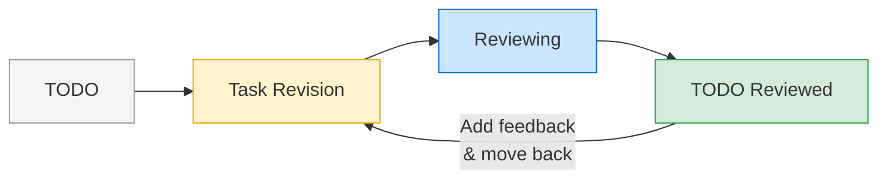
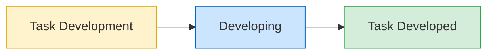

```
  ___  ____  ____   ___  ____  ___                .-""""""-.
 / __)( ___)(  _ \ / __)(_  _)/ _ \             .'           '.
 \__ \ )__)  )   /( (_-. _)(_( (_) )          /    O      O    \
 (___/(____)(__\_)\___/(____)\___/           :       \__/       :
                                             |     ________     |
     _    ___                                 :   /        \   :
    /_\  |_ _|                                \  | ~~~~~~~~ |  /
   / _ \  | |                                  '.\          /.'
  /_/ \_\|___|                                    '-......-'
```
<div align="center">

# Sergio AI

### Trello AI teammate that reviews the Product Manager PRD and designs  trello cards with knowledge about your codebase, helps you makeing a plan and initiates the PR.

[Starting from Scratch](#starting-from-scratch) · [Getting Started](#getting-started) · [How It Works](#how-it-works) · [Configuration](#configuration)

</div>

---

**Why**: You have a team where a Product Manager designs and writes features with limited knowledge about the codebase. The PM can ask Sergio to review the feature and suggest improvements and explain the implementation details to the Product Manager, until ready and clear for the Development team. The Development team can at this point ask Sergio to create a new Draft PR.


**What**: Sergio is a self-hosted bot that connects your **Trello board** to **Claude AI**. Write a task card, drop it in the right list, and Sergio reviews it — producing an implementation plan, asking clarifying questions, or requesting card improvements — then writes the code, runs your tests, and opens a pull request.

It runs on a single VM, polls your board every 60 seconds, and uses sandboxed Claude CLI sessions to do the actual work. No external SaaS, no vendor lock-in, fully open source.

### What it does

1. **Reviews** — Reads your Trello card, explores the codebase, and responds with an implementation plan, clarifying questions, or revision requests
2. **Posts** — Posts the response as a card comment and moves it for human review
3. **Implements** — Once approved, writes the code in an isolated git worktree
4. **Tests** — Runs your test suite automatically
5. **Ships** — Commits, pushes to a feature branch, and opens a pull request

All triggered from a Trello card. You stay in the loop at every step.

---

## How It Works

Sergio uses a 7-list Trello board as its interface. Cards flow left-to-right through two pipelines.

### Planning pipeline



| List | Who | What happens |
|------|-----|-------------|
| **TODO** | You | Write a card describing the task |
| **Task Revision** | Sergio | Reads card + codebase, decides how to respond |
| **Reviewing** | Sergio | Processing state while Claude is working |
| **TODO Reviewed** | You | Review Sergio's response and decide next step |

**Sergio responds with one of three outcomes:**

| Outcome | When | Example |
|---------|------|---------|
| Implementation plan | Card is clear and codebase is understood | Detailed steps referencing actual files and functions |
| Clarifying questions | Card is ambiguous or missing info | "Should sessions auto-extend or have a hard timeout?" |
| Revision requests | Card has contradictions or infeasible requirements | "The card asks for JWT but the codebase uses session tokens" |

The prompt logic lives in `prompts/revision.md`. Sergio always posts its response as a markdown comment on the card.

**Feedback loop:** If the response isn't right, add a comment explaining what to change and move the card back to Task Revision. Sergio re-reads the full card — including all previous comments and your feedback — and responds accordingly.

### Development pipeline



| List | Who | What happens |
|------|-----|-------------|
| **Task Development** | You | Move an approved card here to trigger development |
| **Developing** | Sergio | Creates worktree, writes code, runs tests |
| **Task Developed** | You | PR created — ready for code review |

The bot polls both pipelines concurrently. Planning takes minutes. Development creates a git worktree, runs your dev environment, executes tests, and pushes to GitHub.

---

## Starting from Scratch

Don't have a server yet? Here's how to go from zero to a running Sergio instance for under $5/month.

### 1. Get a cheap VM

Go to [Hetzner Cloud](https://www.hetzner.com/cloud/) (or any VPS provider — DigitalOcean, Vultr, etc.) and create a server:

- **OS:** Ubuntu 24.04
- **Type:** CX22 (2 vCPU, 4 GB RAM) is plenty — Sergio is lightweight, Claude does the heavy lifting via API
- **Location:** Wherever is closest to you
- **SSH key:** Add your public key during creation (recommended over password)

If you don't have an SSH key yet:

```bash
# On your local machine
ssh-keygen -t ed25519 -C "your@email.com"
cat ~/.ssh/id_ed25519.pub
# Copy this output and paste it into Hetzner's SSH key field
```

### 2. SSH into your server

Once the server is created, Hetzner shows you the IP address.

```bash
ssh root@YOUR_SERVER_IP
```


### 3. Initial setup and install Claude
At this point you can ask Claude in your local machine to ssh into the Hatzner VPS and continue the setup, or do this yourself manually.
```bash
# Create a deploy user (don't run Sergio as root)
adduser deploy
usermod -aG sudo deploy
mkdir -p /home/deploy/.ssh
cp ~/.ssh/authorized_keys /home/deploy/.ssh/
chown -R deploy:deploy /home/deploy/.ssh

# Install Node.js and Git
curl -fsSL https://deb.nodesource.com/setup_lts.x | bash -
apt-get install -y nodejs git

# Install Claude CLI
npm install -g @anthropic-ai/claude-code

# Switch to deploy user
su - deploy
```

From here you can just run `claude` in the terminal and ask it to do the rest — clone this repo, run the setup wizard, configure the systemd service. Or continue manually with the [Getting Started](#getting-started) steps below. Make sure that Claude gets access 

From here, follow the [Getting Started](#getting-started) section below.

---

## Getting Started

### Prerequisites

- A Linux VM (Ubuntu/Debian recommended)
- [Node.js](https://nodejs.org/) >= 18
- A [Trello](https://trello.com) account with [API key and token](https://trello.com/power-ups/admin)
- An [Anthropic API key](https://console.anthropic.com/)
- A [GitHub](https://github.com) personal access token

### Quick start

```bash
# Clone and install
git clone https://github.com/Belfio/sergio.git /opt/sergio
cd /opt/sergio
npm install

# Run the interactive setup wizard
npm run setup

# Start
npm start
```

### What the setup wizard does

- **Checks system dependencies** — Node, Git, [Claude CLI](https://docs.anthropic.com/en/docs/claude-code), [GitHub CLI](https://cli.github.com/) — and offers to install any that are missing
- **Creates a `claudeuser`** system account for sandboxed Claude execution
- **Collects your API keys** — Anthropic, Trello, GitHub
- **Creates a Trello board** with 7 pre-configured workflow lists (or connects to an existing board)
- **Generates config files** — `sergio.config.json` and `.env`
- **Copies prompt templates** — editable Markdown files that control Claude's behavior

### Run as a systemd service (recommended for production)

```bash
sudo cp sergio.service /etc/systemd/system/
sudo systemctl daemon-reload
sudo systemctl enable sergio
sudo systemctl start sergio

# Verify
sudo journalctl -u sergio -f
```

---

## Configuration

Sergio uses two config files. Secrets live in `.env` (never committed). Everything else lives in `sergio.config.json` (generated by setup).

### sergio.config.json

```jsonc
{
  "botName": "Sergio",           // Name used in Trello lists, logs, branch prefixes
  "trello": {
    "boardId": "...",
    "lists": { /* list IDs set automatically by setup */ }
  },
  "github": { "repoUrl": "https://github.com/you/your-repo" },
  "repoDir": "/opt/your-repo",  // Path to the repo Sergio works on
  "worktreeBaseDir": "/opt/worktrees",
  "urlAllowList": [              // URLs Claude is allowed to access (see Security)
    "https://github.com",
    "https://docs.google.com",
    "https://www.figma.com"
  ],
  "prompts": {
    "revisionTemplate": "prompts/revision.md",
    "developmentTemplate": "prompts/development.md"
  },
  "timeouts": {
    "claudeDevMs": 1200000,      // 20 min
    "sstDevMs": 600000,          // 10 min
    "testMs": 600000             // 10 min
  },
  "pollIntervalMs": 60000       // 1 min
}
```

### .env

```
ANTHROPIC_API_KEY=sk-ant-...
TRELLO_API_KEY=...
TRELLO_TOKEN=...
GITHUB_TOKEN=ghp_...
```

### Re-configuring

Run `npm run setup` again at any time. If `sergio.config.json` exists, the wizard asks what to update — Trello board, GitHub, URL allow list, or prompts — without recreating everything.

---

## Customizing Prompts

Sergio's Claude behavior is driven by two editable Markdown templates:

| File | Used for |
|------|----------|
| `prompts/revision.md` | Planning — Claude reviews cards and responds with a plan, questions, or revision requests |
| `prompts/development.md` | Development — Claude writes code |

### Placeholders

| Placeholder | Replaced with |
|-------------|---------------|
| `{{botName}}` | Bot name from config |
| `{{cardContent}}` | Full Trello card (description + comments + attachments) |
| `{{urlPolicy}}` | Auto-generated URL restriction policy, or empty string |

Add your coding standards, framework conventions, or architectural constraints directly to these templates. Claude will follow them on every task.

---

## Security

### Sandboxed execution

Claude CLI runs under a dedicated `claudeuser` system account, isolated from your deploy user. This limits what Claude can access on the filesystem.

### URL allow list

When `urlAllowList` is configured, Sergio enforces it at two levels:

**Prompt-level (always active)** — Every Claude session includes:

```
URL ACCESS POLICY: You are ONLY permitted to access these URLs:
- https://docs.example.com
Do NOT fetch, read, or access any URL not on this list.
```

**Network-level (optional)** — For defense-in-depth:

```bash
sudo bash scripts/setup-firewall.sh
```

Configures `iptables` so `claudeuser` can only reach Trello, GitHub, and your allow-listed hosts. All other outbound traffic is dropped.

---

## Logs

Sergio writes a human-readable log file at `logs/sergio.log` (configurable via `logsDir` in `sergio.config.json`). All console output — poll activity, card processing, errors — is appended to this file with timestamps and log levels.

```
2026-02-18T14:30:01.123Z [INFO] Sergio starting...
2026-02-18T14:30:01.456Z [INFO] Board ID: abc123
2026-02-18T14:31:01.789Z [INFO] Found 1 new card(s)
2026-02-18T14:31:05.012Z [INFO] Processing card: Add login page (card123)
2026-02-18T14:31:45.345Z [ERROR] Error processing card card456 (Broken task): ...
```

To follow logs in real time:

```bash
tail -f logs/sergio.log
```

When running as a systemd service, logs also go to journald (`journalctl -u sergio -f`). The log file is useful for sharing with teammates or reviewing past activity without SSH access.

### Status dashboard

Run `npm run status` to get a snapshot of Sergio's current state. It shows:

- **Services** — whether the Sergio polling loop is running and how many Claude CLI sessions are active
- **Board** — card count per Trello list with card names, so you see exactly what's queued, in progress, and done
- **Recent Activity** — last 10 lines from `sergio.log`, color-coded by log level

Example output:

```
  SERGIO STATUS  2/19/2026, 4:30:00 PM

── Services ──
  Sergio polling:  active
  Claude sessions: 2 active

── Board ──
    0  TODO
    1  Sergio Task Revision        Add dark mode
    0  Sergio Reviewing
    2  TODO Reviewed               Login page, API caching
    0  Sergio Task Development
    1  Sergio Developing           User settings
    3  Task Developed

  Total: 7 card(s) across 7 lists

── Recent Activity ──
  2026-02-19T16:29:01.123Z [INFO] Found 1 new card(s)
  2026-02-19T16:29:05.456Z [INFO] Processing card: Add dark mode (abc123)
```

---

## Project Structure

```
src/
  config.ts            Config loader (sergio.config.json + .env)
  logger.ts            File logging (tees console output to logs/sergio.log)
  status.ts            Terminal dashboard (npm run status)
  index.ts             Entry point with concurrent polling loops
  trello.ts            Trello REST API client
  processor.ts         Planning pipeline (card to Claude to plan to comment)
  dev-processor.ts     Dev pipeline (worktree to Claude to tests to PR)
  claude.ts            Claude CLI runner for planning
  claude-dev.ts        Claude CLI runner for development
  template.ts          Prompt template engine
  list-names.ts        Dynamic list name generator
  state.ts             Planning state persistence
  dev-state.ts         Dev state persistence
  setup/
    index.ts           Setup wizard orchestrator
    prompts.ts         Interactive question flow
    trello-setup.ts    Board and list creation via Trello API

prompts/               Editable prompt templates
scripts/               Firewall and utility scripts
```

---

## FAQ

<details>
<summary><strong>Why Trello?</strong></summary>

Trello is a simple, visual interface that non-technical team members already know. No CLI to learn, no new app to install — just drag a card.
</details>

<details>
<summary><strong>Why Claude CLI instead of the API directly?</strong></summary>

Claude CLI provides full agentic capabilities — reading files, navigating the codebase, running tools — in a sandboxed session. The raw API alone does not give you that.
</details>

<details>
<summary><strong>Can I change the bot name?</strong></summary>

Yes. Set `botName` during setup (or edit `sergio.config.json`) and all list names, log messages, and branch prefixes update automatically.
</details>

<details>
<summary><strong>Can I use an existing Trello board?</strong></summary>

Yes. During setup, choose not to create a new board and provide your board and list IDs manually.
</details>

<details>
<summary><strong>What if Sergio's response isn't right?</strong></summary>

Add a comment to the card explaining what needs to change, then move it back to the task revision list. Sergio re-reads the full card — including all previous comments and your feedback — and responds accordingly. If it asked questions and you answered them, it will incorporate your answers into a plan. If it produced a plan and you gave feedback, it will revise the plan.
</details>

<details>
<summary><strong>Is this production-ready?</strong></summary>

Sergio is used in production by its creators. That said, it is early-stage open source — test in a non-critical environment first and report any issues.
</details>

---

## Contributing

Contributions are welcome! Please [open an issue](https://github.com/Belfio/sergio/issues) to discuss what you'd like to change before submitting a PR.

```bash
git clone https://github.com/Belfio/sergio.git
cd sergio
npm install
npm run setup
npm start
```

---

<div align="center">

**[MIT License](LICENSE)**

</div>
